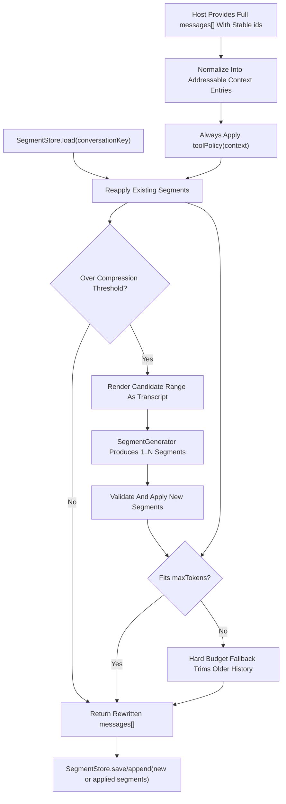

# ai-sdk-context-management

Reusable context compression for AI SDK-style `messages[]` arrays and other long-running conversational systems.

This package helps when a conversation is too large to send as-is. It can:
- rewrite an outgoing `messages[]` array before the model call
- apply an always-on policy to tool calls and tool results
- reapply previously generated summary segments
- ask an LLM to compress older transcript ranges into replacement segments
- enforce a final hard token-budget fallback if needed

The main entrypoint is `contextCompression(...)`. You pass it `messages[]` with a stable top-level `id` on every entry, and it returns rewritten `messages[]` plus compression metadata.

## High-Level Flow



## Quick Start

```ts
import {
  contextCompression,
  createObjectSegmentGenerator,
  createSegmentGenerator,
  defaultToolPolicy,
} from "ai-sdk-context-management";

const result = await contextCompression({
  messages: [
    { id: "msg-1", role: "system", content: "You are helpful." },
    { id: "msg-2", role: "user", content: [{ type: "text", text: "Summarize the migration." }] },
    { id: "msg-3", role: "assistant", content: [{ type: "text", text: "I am reviewing the plan." }] },
  ],
  maxTokens: 128_000,
  compressionThreshold: 0.8,
  protectedTailCount: 4,
  toolPolicy: defaultToolPolicy,
  conversationKey: "conv-123",
  segmentStore: {
    load: (conversationKey) => loadSegments(conversationKey),
    save: (conversationKey, segments) => saveSegments(conversationKey, segments),
  },
  retrievalToolName: "read_tool_output",
  segmentGenerator: createObjectSegmentGenerator({
    async generate(prompt) {
      return await cheapModel.generateObject(prompt);
    },
  }),
});

await generateText({
  model,
  messages: result.messages,
});
```

## Core Ideas

- The full conversation remains the source of truth.
- Summary segments are host-owned state. This package does not keep hidden conversation memory.
- `toolPolicy(context)` always runs, even when the conversation is still below the segment-compression threshold.
- Segment generation is range-based: the engine compresses an older candidate block and keeps the protected tail intact.
- Stable top-level message IDs are required. The package does not infer durable IDs from message text.

## What You Can Customize

- `toolPolicy(context)`
  - Decide separately what to do with the tool call and the tool result.
- `beforeToolCompression(entries)`
  - Inspect the proposed tool-compression plan and optionally return the final per-entry decisions.
- `retrievalToolName` / `retrievalToolArgName`
  - Replace truncated or removed tool content with a retrieval instruction that references the stable message ID.
- `segmentGenerator`
  - Use `createSegmentGenerator(...)`, `createObjectSegmentGenerator(...)`, or provide your own implementation.
- `promptTemplate` / `buildPrompt(input)`
  - Customize the default segment-generation prompt.
- `transcriptRenderer`
  - Change how the candidate range is rendered before LLM compression.
- `segmentStore`
  - Persist segments across turns with `save(...)` or `append(...)`.
- `cache`
  - Memoize repeated rewrites of the same `messages[]` plus segment state.

## Learn By Example

The top-level README stays intentionally high level. The practical guide lives in [`examples/README.md`](./examples/README.md).

Recommended reading order:
1. `examples/01-basic-passthrough.ts`
2. `examples/02-tool-output-policies.ts`
3. `examples/03-persisted-segments.ts`
4. `examples/04-full-pipeline.ts`
5. `examples/05-manage-context.ts`
6. `examples/06-segment-generator-prompt.ts`
7. `examples/07-transcript-and-utilities.ts`

## Main Exports

- `contextCompression(...)`
- `createObjectSegmentGenerator(...)`
- `createSegmentGenerator(...)`
- `buildDefaultSegmentPrompt(...)`
- `DEFAULT_SEGMENT_PROMPT_TEMPLATE`
- `createTranscript(...)`
- `applySegments(...)`
- `validateSegments(...)`
- `buildSummaryMessage(...)`
- `defaultToolPolicy(...)`
- `createCompressionCache(...)`

## License

MIT
